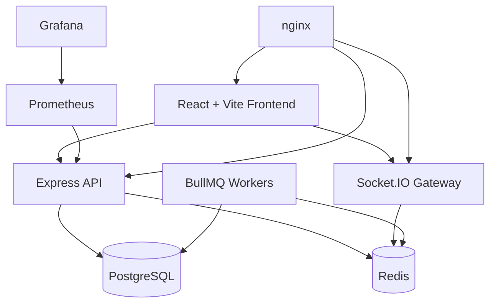
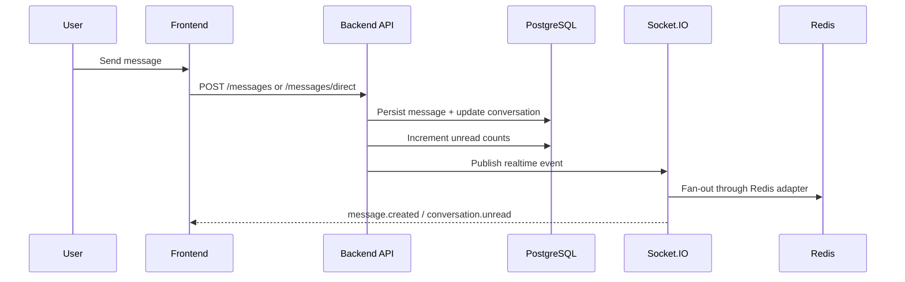
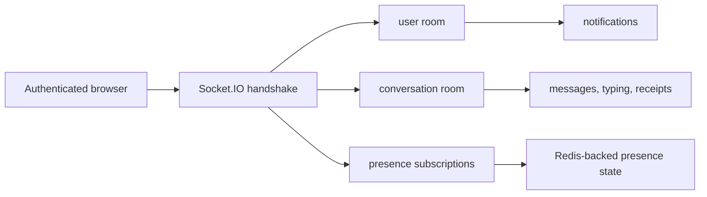
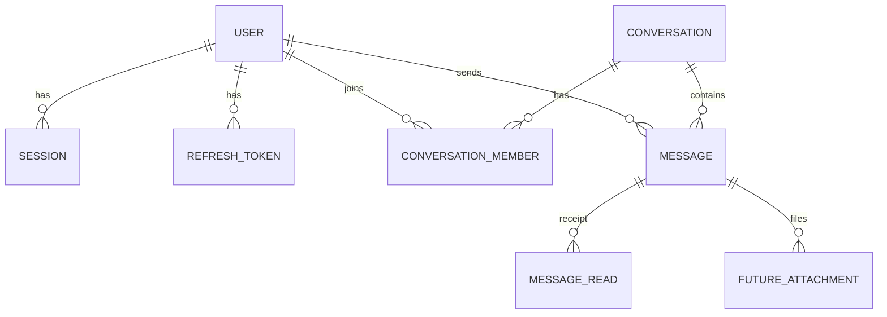

# Chat

> A full-stack chat platform built with React, Express, Prisma, PostgreSQL, Redis, Socket.IO, and BullMQ, with an admin surface, observability, and Docker-based deployment.


-9E9E9E)

> Hero image placeholder: add a product screenshot, animated demo, or architecture graphic here.

## Table Of Contents

- [Overview](#-overview)
- [Features](#-features)
- [Architecture](#-architecture)
- [Folder Structure](#-folder-structure)
- [Tech Stack](#-tech-stack)
- [Getting Started](#-getting-started)
- [Environment Variables](#-environment-variables)
- [API Overview](#-api-overview)
- [Realtime Architecture](#-realtime-architecture)
- [Queue System](#-queue-system)
- [Database](#-database)
- [Observability](#-observability)
- [Security](#-security)
- [Testing](#-testing)
- [Docker Deployment](#-docker-deployment)
- [CI/CD](#-cicd)
- [Screenshots](#-screenshots)
- [Performance](#-performance)
- [Roadmap](#-roadmap)
- [Contributing](#-contributing)
- [License](#-license)
- [Author](#-author)

## 🚀 Overview

`Chat` is a production-oriented messaging application with a React/Vite frontend and a modular Express backend. The codebase supports direct messaging, group conversations, realtime presence and typing, notifications, search, moderation tooling, attachment metadata workflows, and containerized deployment.

The repository is structured as two applications:

- `frontend/` serves the web client.
- `backend/` exposes the REST API, Socket.IO gateway, job scheduler, and observability endpoints.

Primary use cases supported by the current implementation:

- person-to-person messaging
- group collaboration
- admin moderation and audit workflows
- searchable message and directory data
- observable, Docker-based local and production deployment

The target audience is teams building or evaluating a modern chat stack, contributors interested in realtime systems, and recruiters reviewing full-stack architecture and operations depth.

## ✨ Features

### Authentication

- Cookie-based login and registration flows
- JWT access tokens and refresh-token rotation
- Session restore via `/auth/me` and `/auth/refresh`
- Logout and session revocation support
- Audit logging around auth activity
- Login/register-specific rate limiting

### Messaging

- Direct messaging with lazy direct-conversation creation
- Group conversations
- Message send, retry, soft delete, star, and pin/unpin flows
- Reply target validation
- Cursor-based message pagination
- Read receipts and unread counters
- Optimistic message handling with client idempotency keys

### Realtime

- Socket.IO transport with Redis adapter
- Per-user and per-conversation room fan-out
- Presence status, last seen, privacy, and heartbeats
- Typing indicators
- Conversation unread updates
- Notification fan-out and inbox updates

### Groups

- Create, update, and delete groups
- Add/remove members
- Change member role
- Leave group
- Transfer ownership

### Search

- Search messages
- Search users
- Search groups
- Search conversations
- PostgreSQL full-text search (`to_tsvector`, `to_tsquery`, `websearch_to_tsquery`)

### Notifications

- List notifications
- Unread count
- Mark single notification as read
- Mark all notifications as read
- Delete notification
- Realtime notification updates and in-app toasts

### Uploads

- Attachment metadata lifecycle
- Create pending upload records
- Mark upload complete or failed
- Delete unused uploads
- Type-aware validation for image, video, voice, document, and sticker metadata

### Administration

- User moderation
- Suspend / unsuspend user
- Soft delete / restore user
- Force logout all sessions for a user
- Conversation and group moderation
- Message moderation
- Reports workflow
- Audit log views

### Infrastructure

- Dockerfiles for frontend and backend
- Development and production Docker Compose stacks
- Redis-backed Socket.IO and queue infrastructure
- Prometheus metrics
- Grafana dashboards
- Health and readiness endpoints
- Structured backend logging
- OpenTelemetry hooks

## 🏗️ Architecture

### System Architecture



### Request Flow



### Realtime Flow



The backend boot path wires together:

- Express app creation
- Prisma and Redis connections
- Socket.IO gateway initialization
- BullMQ scheduler/workers
- health checks and metrics registration
- graceful shutdown for HTTP, sockets, Redis, Prisma, and observability

## 🗂️ Folder Structure

```text
chat-app/
├── .github/
│   └── workflows/ci.yml
├── backend/
│   ├── src/
│   │   ├── modules/
│   │   ├── websocket/
│   │   ├── jobs/
│   │   ├── observability/
│   │   ├── routes/
│   │   └── database/
│   ├── prisma/
│   ├── tests/
│   ├── docs/
│   ├── Dockerfile
│   └── .env.example
├── frontend/
│   ├── src/
│   │   ├── components/
│   │   ├── pages/
│   │   ├── sections/
│   │   ├── redux/
│   │   ├── services/
│   │   ├── hooks/
│   │   └── routes/
│   ├── docs/
│   ├── public/
│   ├── Dockerfile
│   └── .env.example
├── deploy/
│   ├── nginx/
│   ├── redis/
│   ├── prometheus/
│   ├── grafana/
│   ├── certs/
│   └── scripts/
├── docs/
├── docker-compose.dev.yml
├── docker-compose.prod.yml
├── .env.staging.example
└── .env.production.example
```

### Directory Guide

| Path | Purpose |
|---|---|
| `frontend/` | React client, Redux state, REST adapters, Socket.IO client, tests |
| `backend/src/modules/` | Feature modules: auth, users, conversations, messages, groups, presence, uploads, notifications, search, admin |
| `backend/src/websocket/` | Socket.IO gateway, auth middleware, controllers, room/event plumbing |
| `backend/src/jobs/` | BullMQ scheduler, queue manager, workers, idempotency support |
| `backend/src/observability/` | metrics, health checks, tracing, instrumentation |
| `backend/prisma/` | Prisma schema, data model docs, SQL helpers |
| `deploy/` | nginx, Redis, Prometheus, Grafana, certificates, backup scripts |
| `docs/` | deployment, Docker, env, operations, production readiness |
| `.github/workflows/ci.yml` | CI for backend, frontend, and Docker verification |

## 🧰 Tech Stack

### Frontend

| Category | Stack |
|---|---|
| Framework | React 18 |
| Bundler | Vite 5 |
| Language | TypeScript 6 |
| UI | MUI, Emotion |
| State | Redux Toolkit, React Redux, redux-persist |
| Forms | react-hook-form, Yup |
| Routing | React Router 6 |
| Realtime | socket.io-client |
| Testing | Vitest, Testing Library, jsdom |

### Backend

| Category | Stack |
|---|---|
| Runtime | Node.js 22 |
| Framework | Express 4 |
| Language | TypeScript |
| Validation | Zod |
| Auth | JWT, HttpOnly cookies, bcrypt |
| ORM | Prisma |
| Realtime | Socket.IO |
| Queues | BullMQ |
| Logging | Pino, pino-http |

### Database & Search

| Category | Stack |
|---|---|
| Primary database | PostgreSQL 16 |
| Cache / coordination | Redis 7 |
| Search | PostgreSQL full-text search |
| Pagination | Cursor/keyset patterns |

### Infrastructure & Observability

| Category | Stack |
|---|---|
| Containers | Docker |
| Orchestration | Docker Compose |
| Edge proxy | nginx |
| Metrics | Prometheus |
| Dashboards | Grafana |
| Tracing | OpenTelemetry (configurable) |
| CI | GitHub Actions |

## 🏁 Getting Started

### Prerequisites

- Node.js 22+
- npm
- PostgreSQL
- Redis
- Docker Engine + Compose v2 (optional, recommended)

### Clone

```bash
git clone <your-fork-or-repo-url>
cd chat-app
```

### Backend Setup

```bash
cd backend
cp .env.example .env
npm ci
npm run prisma:generate
npm run prisma:migrate
npm run dev
```

Backend runs on `http://localhost:3000` by default.

### Frontend Setup

```bash
cd frontend
cp .env.example .env
npm ci
npm run dev
```

Frontend runs on `http://localhost:5173` by default.

### Docker (Development / Staging-like)

```bash
cp .env.staging.example .env
docker compose -f docker-compose.dev.yml --env-file .env up --build
```

Default edge URL: `http://localhost:8080`

### Docker (Production)

```bash
cp .env.production.example .env
# fill secrets first
printf '%s' "$METRICS_TOKEN" > deploy/prometheus/bearer.token
docker compose -f docker-compose.prod.yml --env-file .env up -d --build
```

For production details, see:

- [`docs/DEPLOYMENT.md`](./docs/DEPLOYMENT.md)
- [`docs/DOCKER.md`](./docs/DOCKER.md)
- [`docs/OPERATIONS.md`](./docs/OPERATIONS.md)

## 🔐 Environment Variables

### Frontend

| Variable | Required | Description |
|---|---:|---|
| `VITE_CHAT_SERVICE_MODE` | Yes | `rest` for the real backend |
| `VITE_API_BASE_URL` | Yes in REST mode | API base path, typically `/api` |
| `VITE_SOCKET_URL` | No | Empty uses same-origin Socket.IO |
| `VITE_API_TIMEOUT_MS` | No | REST timeout, default `15000` |
| `VITE_APP_NAME` | No | Display name baked into the build |

### Backend

| Variable | Required | Description |
|---|---:|---|
| `NODE_ENV` | Yes | `development`, `production`, or `test` |
| `HOST` | Yes | Bind address |
| `PORT` | Yes | HTTP port |
| `API_PREFIX` | Yes | API prefix, default `/api` |
| `DATABASE_URL` | Yes | PostgreSQL connection string |
| `REDIS_URL` | Yes | Redis connection string |
| `JWT_ACCESS_SECRET` | Yes | Access token signing secret |
| `JWT_REFRESH_SECRET` | Yes | Refresh token signing secret |
| `JWT_ACCESS_EXPIRES_IN` | No | Access token lifetime |
| `JWT_REFRESH_EXPIRES_IN` | No | Refresh token lifetime |
| `JWT_ISSUER` | No | JWT issuer |
| `JWT_AUDIENCE` | No | JWT audience |
| `COOKIE_NAME` | No | Session cookie name |
| `COOKIE_SECURE` | Production yes | Must be `true` in production |
| `COOKIE_SAME_SITE` | No | Cookie SameSite setting |
| `CORS_ORIGIN` | Yes | Exact browser origin |
| `RATE_LIMIT_WINDOW_MS` | No | Rate-limit window |
| `RATE_LIMIT_MAX` | No | Requests allowed in window |
| `LOG_LEVEL` | No | Pino log level |
| `METRICS_ENABLED` | No | Enables metrics endpoint |
| `METRICS_ROUTE` | No | Metrics route path |
| `METRICS_TOKEN` | Production yes | Protects `/metrics` and queue-health checks |
| `METRICS_DEFAULT_LABELS` | No | Prometheus default labels |
| `OTEL_ENABLED` | No | Enables tracing |
| `OTEL_SERVICE_NAME` | No | OpenTelemetry service name |
| `OTEL_EXPORTER_OTLP_ENDPOINT` | No | OTLP endpoint |
| `OTEL_EXPORTER_OTLP_HEADERS` | No | OTLP headers |
| `OTEL_TRACES_SAMPLER_RATIO` | No | Trace sample ratio |
| `OBSERVABILITY_STARTUP_TIMEOUT_MS` | No | Startup health timeout |

### Queue / Job Runtime

These are read by `backend/src/jobs/jobConfig.ts`.

| Variable | Description |
|---|---|
| `JOBS_ENABLED` | Toggle BullMQ processing |
| `JOBS_PREFIX` | Queue namespace prefix |
| `JOBS_MAX_ATTEMPTS` | Retry attempts |
| `JOBS_BACKOFF_MS` | Exponential backoff base |
| `JOBS_CONCURRENCY` | Per-queue worker concurrency |
| `JOBS_IDEMPOTENCY_TTL_SEC` | TTL for idempotency keys |
| `JOBS_CRON_PRESENCE_CLEANUP` | Presence cleanup schedule |
| `JOBS_CRON_SESSION_CLEANUP` | Session cleanup schedule |
| `JOBS_CRON_AUDIT_CLEANUP` | Audit cleanup schedule |
| `JOBS_CRON_ATTACHMENT_CLEANUP` | Attachment cleanup schedule |
| `JOBS_CRON_NOTIFICATION_CLEANUP` | Notification cleanup schedule |
| `JOBS_CRON_MESSAGE_EXPIRE` | Message expiry schedule |
| `JOBS_CRON_UNREAD_RECONCILE` | Unread reconcile schedule |
| `JOBS_CRON_LAST_MESSAGE_REPAIR` | Last-message repair schedule |

### Compose / Operations

| Variable | Description |
|---|---|
| `POSTGRES_USER`, `POSTGRES_PASSWORD`, `POSTGRES_DB` | Database bootstrap |
| `HTTP_PORT`, `HTTPS_PORT` | nginx published ports |
| `BACKEND_PORT`, `FRONTEND_PORT`, `POSTGRES_PORT`, `REDIS_PORT` | Dev compose ports |
| `GRAFANA_ADMIN_USER`, `GRAFANA_ADMIN_PASSWORD` | Grafana credentials |
| `GRAFANA_ROOT_URL` | Public Grafana URL |
| `TLS_CERTS_DIR` | TLS cert mount path |

Reference docs:

- [`backend/.env.example`](./backend/.env.example)
- [`frontend/.env.example`](./frontend/.env.example)
- [`docs/ENV_REFERENCE.md`](./docs/ENV_REFERENCE.md)

## 🔌 API Overview

The backend exposes its feature modules under `API_PREFIX` (default `/api`).

### Auth

- register
- login
- logout
- current session (`me`)
- refresh

### Users

- list users
- search users
- get user by ID
- update own profile

### Conversations

- list inbox conversations
- get a conversation
- mark as read
- mute / unmute

### Messages

- send into an existing conversation
- start/send a direct message
- fetch paginated messages
- retry failed message
- soft delete
- star / unstar
- pin / unpin

### Groups

- create group
- update metadata
- add / remove members
- change role
- leave group
- transfer ownership

### Uploads

- create upload metadata
- fetch upload metadata
- complete upload
- fail upload
- delete unused upload metadata

### Presence

- current presence
- presence by user
- preferred status update
- privacy update

### Notifications

- list notifications
- unread count
- mark one read
- mark all read
- delete notification

### Search

- messages
- users
- groups
- conversations

### Admin

- user moderation
- conversation moderation
- group moderation
- message moderation
- reports
- audit logs

### Health & Metrics

- `/health`
- `/ready`
- `/health/queues`
- `/metrics`

For deeper route-level documentation:

- [`backend/docs/api-verification/README.md`](./backend/docs/api-verification/README.md)
- [`backend/docs/api-verification/ENDPOINT_INVENTORY.md`](./backend/docs/api-verification/ENDPOINT_INVENTORY.md)
- [`backend/docs/api-verification/API_TESTING_GUIDE.md`](./backend/docs/api-verification/API_TESTING_GUIDE.md)
- [`backend/docs/api-verification/Chat-API.postman_collection.json`](./backend/docs/api-verification/Chat-API.postman_collection.json)

## ⚡ Realtime Architecture

The realtime layer uses Socket.IO with a Redis adapter so pub/sub traffic can fan out beyond a single Node.js process.

### Verified Realtime Events

- messages: created, updated, deleted, delivered, read, retried, starred, unstarred, pinned, unpinned
- conversations: created, updated, deleted, unread
- group membership: joined, left, removed, role changed, ownership transferred
- presence: online, offline, last seen, status changed
- typing: start / stop
- uploads: completed, failed
- notifications: created, updated

### Rooms

- user rooms
- conversation rooms
- group rooms
- presence rooms

### Authentication

- socket handshake is authenticated
- cookies and backend auth service are used to resolve identity
- session revocation can disconnect active sockets

### Presence

- Redis-backed live device state
- multi-device online tracking
- preferred status: `ONLINE`, `AWAY`, `INVISIBLE`
- privacy controls for presence visibility and last seen
- frontend heartbeats keep presence TTL alive

## 🧵 Queue System

BullMQ is used for background orchestration, retries, metrics, and scheduled maintenance.

### Queues

- message
- notification
- upload
- conversation
- presence
- maintenance
- dead-letter queue

### Worker Responsibilities

| Worker | Current responsibility |
|---|---|
| Message worker | delivery events, retry orchestration, expiry scheduling hooks |
| Notification worker | notification processing / fan-out support |
| Upload worker | upload lifecycle orchestration |
| Presence worker | cleanup scheduling |
| Conversation worker | unread/repair placeholders |
| Maintenance worker | cleanup placeholders |

### Retries & Idempotency

- configurable max attempts
- exponential backoff
- idempotency TTL for queued work
- dead-letter queue support in the jobs layer

### Important Current State

Some scheduled workers are intentionally placeholders or no-ops in the current repository:

- unread reconcile
- last-message repair
- attachment cleanup
- audit cleanup
- session cleanup
- some upload post-processing

That means the queue architecture is present, but not every maintenance path is fully implemented yet.

## 🗄️ Database

The backend uses Prisma over PostgreSQL.

### Core Entities

- users
- sessions
- refresh tokens
- conversations
- conversation members
- messages
- message reads
- pinned messages
- starred messages
- notifications
- audit logs
- reports
- attachments

### Relationship Overview



### Migration Strategy

- local development uses Prisma commands directly
- production container startup runs `prisma migrate deploy`
- docs explicitly recommend not running `prisma migrate dev` in production

Reference:

- [`backend/prisma/schema.prisma`](./backend/prisma/schema.prisma)
- [`backend/prisma/DATA_MODEL.md`](./backend/prisma/DATA_MODEL.md)

## 📈 Observability

The codebase includes a real observability surface instead of treating it as an afterthought.

### Health

- `/health` for liveness
- `/ready` for readiness
- `/health/queues` for queue health

### Metrics

- Prometheus-compatible metrics route
- token-protected scraping
- queue, socket, Redis, and database instrumentation

### Dashboards

- Grafana provisioning is checked into `deploy/grafana/`
- Prometheus alert rules live in `deploy/prometheus/alerts.yml`

### Tracing

- OpenTelemetry configuration exists and can export OTLP traces when enabled

### Logging

- Pino structured logs in the backend
- JSON nginx access logs in Docker deployment
- request correlation support is exercised by observability tests

## 🛡️ Security

Security-related implementation visible in the repository includes:

- JWT access and refresh token flow
- HttpOnly session cookies
- refresh-token rotation and revocation
- bcrypt password hashing
- request validation with Zod
- admin route protection
- structured audit logging
- rate limiting
- CORS configuration
- Helmet and security headers
- cookie security guardrails for production
- protected metrics endpoint
- safe URL handling utilities for external links/media

## 🧪 Testing

### What Is Covered

- backend service tests
- backend HTTP tests with Supertest
- websocket tests
- observability tests
- frontend slice/service/component tests
- route guard tests

### Repository Test Surface

| Area | Evidence in repo |
|---|---|
| Backend tests | 43 test files under `backend/tests/` |
| Frontend tests | 10 test files under `frontend/src/` |
| CI execution | backend and frontend `npm test` in GitHub Actions |

The repository does not version a single authoritative "current passing test count" artifact, so the README does not claim one. CI verifies both suites on every push/PR.

## 🐳 Docker Deployment

### Development

```bash
cp .env.staging.example .env
docker compose -f docker-compose.dev.yml --env-file .env up --build
```

Services:

- Postgres 16
- Redis 7
- backend
- frontend
- nginx

### Production

```bash
cp .env.production.example .env
printf '%s' "$METRICS_TOKEN" > deploy/prometheus/bearer.token
docker compose -f docker-compose.prod.yml --env-file .env up -d --build
```

Additional production services:

- Prometheus
- Grafana

### Deployment Notes

- prod frontend is served through nginx
- prod backend is internal behind nginx
- Socket.IO is proxied through `/socket.io/`
- HTTPS support is documented through `deploy/certs/` and nginx SSL config examples

## 🔄 CI/CD

GitHub Actions CI lives in [`.github/workflows/ci.yml`](./.github/workflows/ci.yml).

### Backend Job

- `npm ci`
- `npx prisma generate`
- `npm run type-check`
- `npm run lint`
- `npm test`
- `npm run build`

### Frontend Job

- `npm ci`
- `npm run type-check`
- `npm run lint`
- `npm test`
- `npm run build`

### Docker Verification

- build backend image
- build frontend image
- validate development compose file
- validate production compose file

## 🖼️ Screenshots

Placeholder sections for repository visuals:

- Authentication
- Chat
- Groups
- Notifications
- Admin
- Search
- Presence

## ⚙️ Performance

Performance-oriented implementation details verified in the codebase:

- cursor/keyset pagination for messages and admin listings
- PostgreSQL full-text search instead of client-side filtering for server search
- Redis for presence, Socket.IO adapter, queues, and rate-limit storage
- message list virtualization in the frontend via `@tanstack/react-virtual`
- conversation unread counters maintained server-side
- Compose health checks and readiness flow to avoid early traffic
- schema-level indexing in Prisma/PostgreSQL for common access patterns

## 🛣️ Roadmap

This roadmap is based on visible gaps or placeholders in the current repository, not aspirational feature guessing.

- Implement real message reactions (server currently has a placeholder path)
- Complete backend support for password reset flows that already exist in frontend routes
- Replace metadata-only upload flow with a binary upload/object storage pipeline
- Finish non-placeholder BullMQ maintenance workers (cleanup, unread reconcile, last-message repair)
- Replace no-op external notification providers with real email / SMS / push integrations
- Decide whether the existing frontend calls page should be backed by real call services or removed from scope

## 🤝 Contributing

Contributions should start with the current architecture and operational docs before code changes.

### Suggested Workflow

1. Fork the repository
2. Create a focused feature branch
3. Use the existing env examples instead of inventing local config
4. Run relevant checks before opening a PR

```bash
# backend
cd backend
npm run type-check
npm run lint
npm test

# frontend
cd ../frontend
npm run type-check
npm run lint
npm test
```

### Helpful References

- [`docs/DEPLOYMENT.md`](./docs/DEPLOYMENT.md)
- [`docs/DOCKER.md`](./docs/DOCKER.md)
- [`docs/OPERATIONS.md`](./docs/OPERATIONS.md)
- [`backend/prisma/DATA_MODEL.md`](./backend/prisma/DATA_MODEL.md)
- [`backend/docs/api-verification/README.md`](./backend/docs/api-verification/README.md)

When contributing new features, keep feature docs, environment examples, and API verification artifacts in sync with the implementation.

## 📄 License

MIT placeholder. Add a top-level `LICENSE` file before publishing the repository publicly.

## 👤 Author

Built as a portfolio-grade full-stack systems project with emphasis on realtime architecture, operational readiness, and backend/frontend integration.
