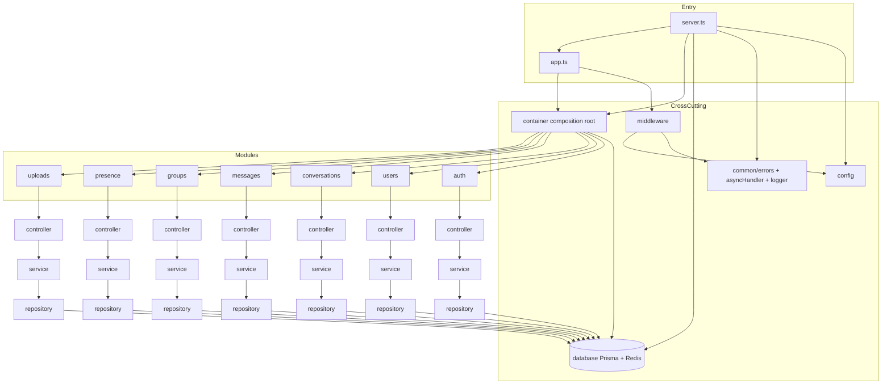

# Backend Architecture

Enterprise layered architecture for the Chat API.  
**Phase: architecture only** — no business endpoints or domain logic yet.  
Frontend (`../frontend`) is unchanged and remains the API consumer.

## Stack

| Concern | Choice |
|--------|--------|
| Runtime | Node.js 22 |
| HTTP | Express |
| Language | TypeScript (strict) |
| ORM | Prisma + PostgreSQL |
| Cache / sessions | Redis (ioredis) |
| Auth (planned) | JWT in HttpOnly cookies |
| Validation | Zod |
| Logging | Pino + pino-http |
| Tests | Vitest + Supertest |
| DI | Custom composition-root `Container` |

---

## Folder tree

```
backend/
├── package.json
├── tsconfig.json
├── tsconfig.build.json
├── vitest.config.ts
├── .env.example
├── .gitignore
├── ARCHITECTURE.md
├── prisma/
│   └── schema.prisma          # Data model skeleton (no migrations yet)
├── tests/
│   └── setup.ts
└── src/
    ├── app.ts                 # Express app factory (middleware + routes)
    ├── server.ts              # Boot, listen, graceful shutdown
    │
    ├── config/
    │   ├── env.ts             # Zod environment validation
    │   └── index.ts           # Typed configuration loader
    │
    ├── common/
    │   ├── errors/
    │   │   ├── AppError.ts    # Central error hierarchy
    │   │   ├── errorCodes.ts
    │   │   └── index.ts
    │   ├── utils/
    │   │   ├── asyncHandler.ts
    │   │   └── logger.ts      # Pino singleton factory
    │   └── types/
    │       └── express.d.ts   # Request augmentation (requestId, user)
    │
    ├── middleware/
    │   ├── errorHandler.ts    # Global error + 404
    │   ├── requestId.ts
    │   ├── responseTime.ts
    │   ├── rateLimiter.ts
    │   ├── security.ts        # Helmet, compression, CORS, cookie-parser
    │   ├── validate.ts        # Zod validateRequest()
    │   ├── requestLogger.ts   # pino-http
    │   └── index.ts
    │
    ├── routes/
    │   ├── health.routes.ts   # GET /health, GET /ready (implemented)
    │   └── index.ts           # Mounts all module routers
    │
    ├── database/
    │   ├── prisma.ts          # Prisma singleton
    │   ├── redis.ts           # Redis singleton
    │   └── index.ts
    │
    ├── container/
    │   ├── container.ts       # DI container
    │   ├── index.ts           # Composition root (wiring)
    │   └── types.ts
    │
    ├── shared/
    │   ├── constants/
    │   │   ├── tokens.ts      # DI Symbol tokens
    │   │   └── NotImplementedError.ts
    │   └── interfaces/
    │       ├── IHealthService.ts
    │       └── HealthService.ts
    │
    ├── modules/
    │   ├── auth/
    │   │   ├── controller/
    │   │   ├── service/
    │   │   ├── repository/
    │   │   ├── routes/        # Empty router (no endpoints)
    │   │   ├── validators/
    │   │   ├── dto/
    │   │   ├── mapper/
    │   │   ├── interfaces/
    │   │   └── index.ts
    │   ├── users/             # same layer layout
    │   ├── conversations/
    │   ├── messages/
    │   ├── groups/
    │   ├── presence/
    │   └── uploads/
    │
    ├── websocket/             # Gateway stub (not implemented)
    │   └── index.ts
    └── jobs/                  # Background jobs stub
        └── index.ts
```

Each feature module always contains: **controller · service · repository · routes · validators · dto · mapper · interfaces**.

---

## Dependency graph



### Layer rules (enforced by structure)

| Layer | May depend on | Must not |
|-------|---------------|----------|
| **routes** | controller, validators, middleware | Prisma, Redis, business rules |
| **controller** | service, dto/mapper (response shaping) | Prisma, repositories, business rules |
| **service** | repositories, other services, domain rules | Express `req`/`res`, Prisma client directly* |
| **repository** | Prisma / Redis | HTTP, other modules’ controllers |
| **validators** | Zod only | — |
| **mapper** | dto + persistence shapes | Express, Prisma client calls |
| **interfaces** | nothing concrete | implementations |

\*Services receive repository **interfaces** via DI; repositories are the only Prisma consumers.

---

## Folder explanations

### `src/app.ts`
Assembles Express: security middleware → request ID → response time → Pino HTTP log → rate limit → body parsers → health + API routers → 404 → global error handler. Does not listen on a port.

### `src/server.ts`
Process entry: validate env, create logger, connect Prisma/Redis, build DI container, create app, listen, register SIGTERM/SIGINT **graceful shutdown** (close HTTP → quit Redis → disconnect Prisma). Initializes WebSocket and jobs scaffolds (no-op).

### `src/config/`
- **`env.ts`** — Zod schema for every env var; fail fast at boot.  
- **`index.ts`** — maps env → typed `AppConfig` (JWT, cookie, CORS, rate limit, etc.).

### `src/common/`
Shared primitives: `AppError` family + error codes matching frontend API contract, `asyncHandler`, Pino logger factory, Express type augmentation.

### `src/middleware/`
Cross-cutting HTTP concerns: Helmet, compression, CORS (credentials + explicit origin), cookie-parser, rate limiter, request ID, response time, Zod validation factory, pino-http, not-found + global error serializer.

### `src/routes/`
HTTP mounting only. Canonical probes at app root (not under `/api`, not duplicated):
- **`GET /health`** — liveness only (no Postgres/Redis)
- **`GET /ready`** — readiness (Postgres + Redis)

Probes are mounted *before* the rate limiter and skipped by logging/rate-limit helpers (`skipOperationalProbes`). Module APIs under `API_PREFIX` remain empty until implementation.

### `src/database/`
**Prisma singleton** and **Redis singleton** with connect/disconnect helpers used by boot and shutdown.

### `src/container/`
Lightweight DI: Symbol tokens, singleton factories, **composition root** (`createContainer`) that wires Controller → Service → Repository for every module plus HealthService.

### `src/modules/*`
Vertical slices aligned with the frontend domain (auth, users, conversations, messages, groups, presence, uploads). Each layer exists; methods are intentionally empty until API implementation.

### `src/prisma/` (repo root `prisma/`)
Schema skeleton for User, sessions, Conversation, members, Message — ready for migrations later. No business migrations run in this phase.

### `src/websocket/`
Reserved for cookie/JWT-authenticated realtime (messages, typing, presence). Stub only.

### `src/jobs/`
Reserved for TTL cleanup, session purge, etc. Stub only.

### `src/shared/`
- `interfaces/` — contracts only (e.g. `IHealthService`)
- `services/HealthService.ts` — operational probe implementation (**architecture exception**: may use Prisma/Redis directly for readiness; domain modules must not)
- `constants/tokens.ts` — DI symbols

---

## Absolute imports (aliases)

Configured in `tsconfig.json` `paths` and mirrored in `vitest.config.ts`:

| Alias | Path |
|-------|------|
| `@/*` | `src/*` |
| `@config/*` | `src/config/*` |
| `@common/*` | `src/common/*` |
| `@middleware/*` | `src/middleware/*` |
| `@database/*` | `src/database/*` |
| `@modules/*` | `src/modules/*` |
| `@shared/*` | `src/shared/*` |
| `@container/*` | `src/container/*` |
| `@routes/*` | `src/routes/*` |
| `@websocket/*` | `src/websocket/*` |
| `@jobs/*` | `src/jobs/*` |

Production build uses `tsc` + `tsc-alias` to rewrite paths in `dist/`.

---

## What is implemented vs deferred

| Implemented (architecture) | Deferred (next phases) |
|----------------------------|------------------------|
| Env validation + config | Auth login/logout/me |
| Logger, request logging | Conversations CRUD |
| Global errors + asyncHandler | Messages send/pagination |
| Security middleware suite | Groups membership |
| Prisma + Redis singletons | Presence WebSocket |
| DI container wiring | Uploads |
| Health / ready checks | All `/api/*` business routes |
| Graceful shutdown | JWT cookie session logic |
| Module folder scaffold | Repository queries |

---

## Local boot (architecture)

```bash
cd backend
cp .env.example .env
npm install
npx prisma generate
# Requires Postgres + Redis when starting the server:
npm run dev
# Probes: GET http://localhost:3000/health
```

Align `CORS_ORIGIN` with the Vite frontend origin and `API_PREFIX=/api` with `VITE_API_BASE_URL`.
