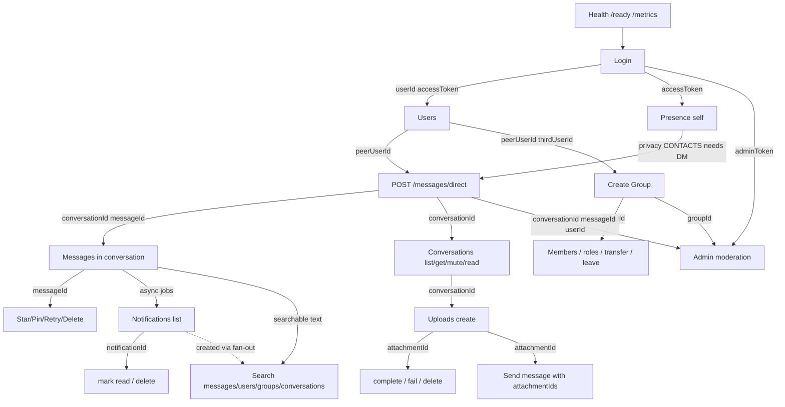

# Dependency Graph

IDs produced by earlier steps must be reused later. Arrows mean “provides identifiers / session needed by”.



## ID reuse table

| Variable | Produced by | Consumed by |
|----------|-------------|-------------|
| `accessToken` | Login Set-Cookie `chat_session_access` | All bearer routes |
| `adminToken` | Admin Login cookie extract | `/api/admin/*` |
| `userId` | Login `{ user.id }` | Presence self checks, admin self-avoid |
| `peerUserId` | Seeded second user / Users list | Direct message, group members, presence, reports |
| `thirdUserId` | Seeded third user | Group add/remove member |
| `conversationId` | `POST /messages/direct` or inbox | Messages, mute/read, uploads, search, admin |
| `messageId` | Send message / direct | star/pin/retry/delete, admin message ops |
| `groupId` | `POST /groups` | Group CRUD/members, admin groups |
| `attachmentId` | `POST /uploads` | complete/fail/delete; message `attachmentIds` |
| `notificationId` | `GET /notifications` (after message fan-out) | mark read / delete |
| `reportId` | `POST /admin/reports` | review / resolve / dismiss |
| cursors | list/search responses `nextCursor` | next page requests |

## Critical path (minimum manual setup)

```
Login (user A)
  → Login (user B) elsewhere → set peerUserId
  → POST /messages/direct { peerUserId }
      → conversationId, messageId
  → GET /conversations
  → GET /conversations/:id/messages
  → POST /groups { memberUserIds: [peerUserId] } → groupId
  → POST /uploads → attachmentId → complete
  → GET /notifications (wait/jobs if enabled)
  → GET /search/messages?q=...
  → GET/POST /presence
  → Login admin → adminToken → /api/admin/...
  → GET /health + /ready + /metrics
```
